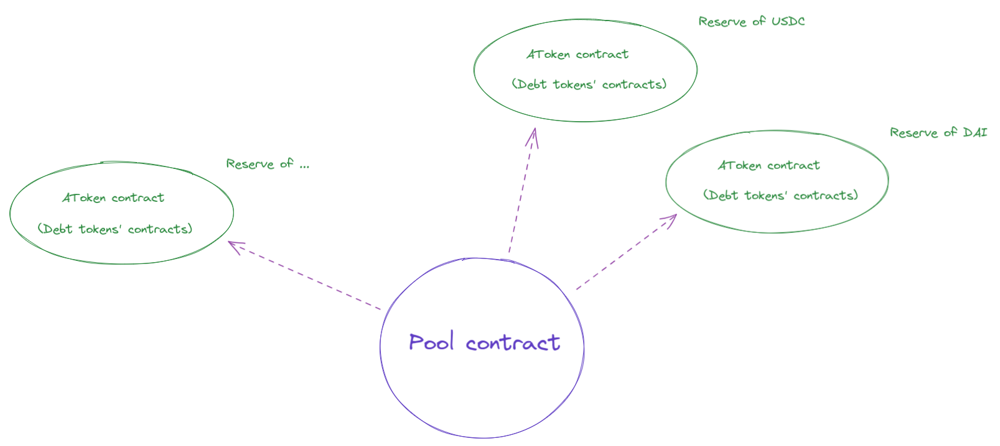

# Cairo exercise

## Aave: Pool and AToken

Pool and AToken are the two main contracts of Aave v3 protocol. The goal of this exercise is to implement a contract Pool that implement some features.

### Pool

Pool is the entrypoint of the protocol. It allows users to deposit and withdraw tokens. It can help configuring the protocol by adding or removing “reserves” i.e. contracts corresponding to an asset - see diagram below.

### AToken

When depositing tokens to the Pool, the latter mints to you aTokens that represent the liquidity deposited. The amount of AToken increase over time, the increase rate being called “liquidity index”.

## Exercise

The goal here is to create a Pool contract that implements the following features, and to test them:

- Add a new reserve
- Drop a reserve
- Supply tokens (= Deposit tokens)
- Withdraw tokens

### Guidelines

- We provide a repository with AToken contract in Cairo, and the interface of Pool contract.
- You should adapt the code from Aave v3’s repository: [https://github.com/aave/aave-v3-core](https://github.com/aave/aave-v3-core).
- This repository relies on [protostar](https://docs.swmansion.com/protostar/). We recommend you to use it to write your tests in Cairo.

### How to make it work?

1. First you need to install [Protostar](https://docs.swmansion.com/protostar/).
2. To install the dependencies, you should run `protostar install`.
3. To build the contracts, you should run `protostar build`.
4. To run the tests, you should run `protostar test`.
